# Built-in dashboard screenshots

A look at the built-in htmx dashboard (`http://<host>:8080/`). It reports
current state plus a short in-memory history. Samples like the CPU
frequency range are kept in RAM for the last **10 minutes** only (see
`internal/history`), enough to smooth out a live reading without hammering
`/metrics`. There are no long-range charts in this UI by design.

For persistent, long-term metrics history beyond 10 minutes, trends, and
alerting, use the Grafana dashboards that ship with the Helm chart,
scraping `/metrics`. Screenshots of those are in
[`grafana-dashboards.md`](grafana-dashboards.md).

See [`README.md`](../README.md) for the design rationale and
[`METRICS.md`](METRICS.md) for the metric reference.

## Cluster overview

Fleet-wide summary: attention banner, hardware totals, per-node system
status, and a nodes table.

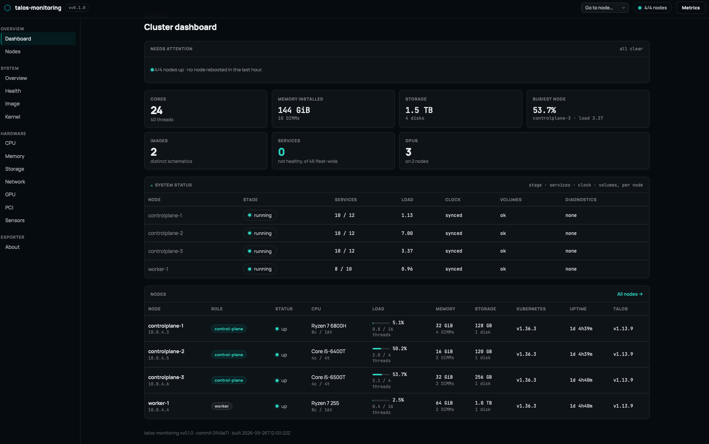

## Nodes

All discovered nodes with role, OS/arch, kubelet and Talos versions, and
status.

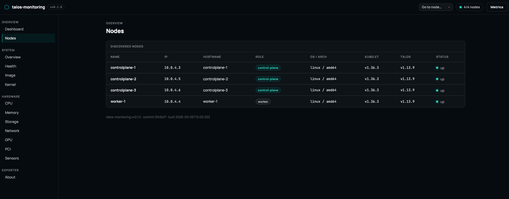

## Node overview

Per-node landing page: machine identity, load, uptime, and a card per
hardware/health category.

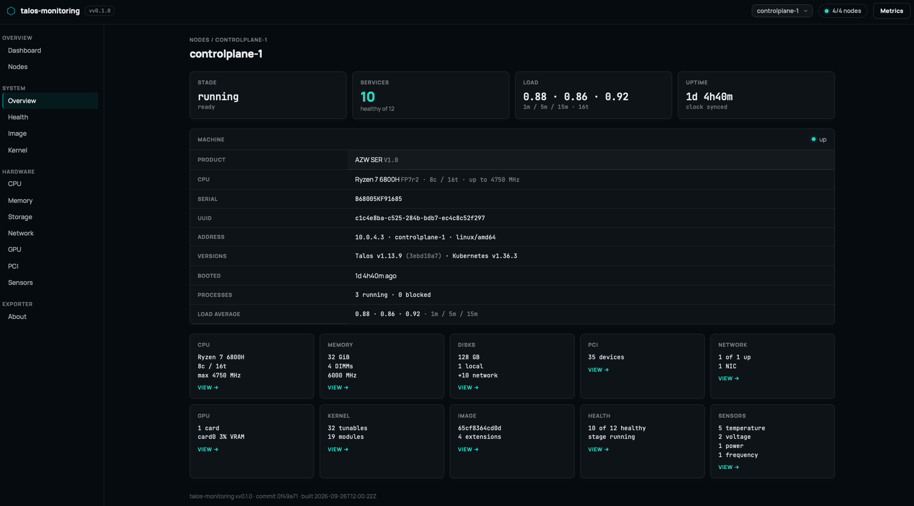

## Health

Machine stage, service health, clock sync, and per-service state.

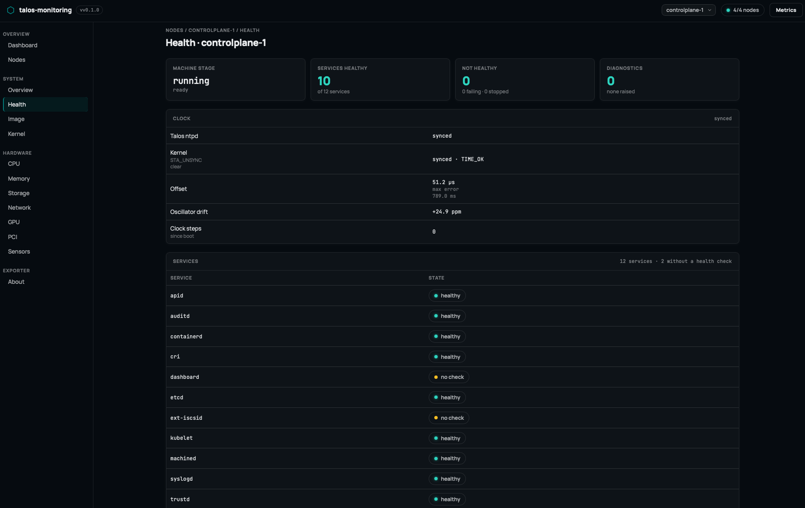

## Image

Schematic, boot entry, installed system extensions, and secure boot
posture.

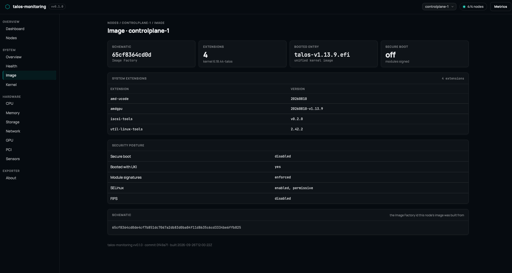

## Kernel

Kernel version, boot command line, and tunables compared against their
defaults.

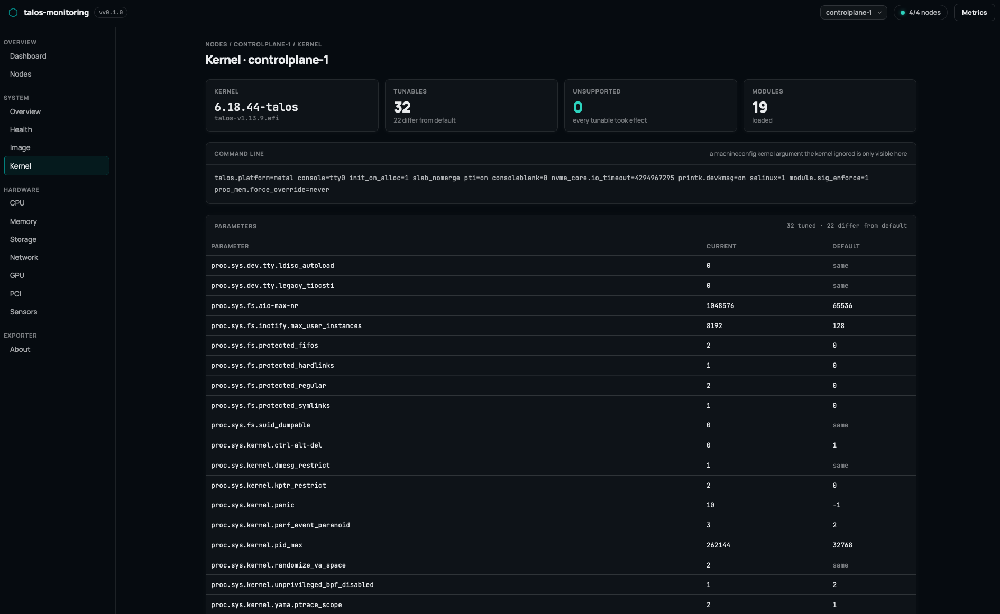

## CPU

Usage breakdown, load average, per-core busy%/frequency, and the observed
frequency range.

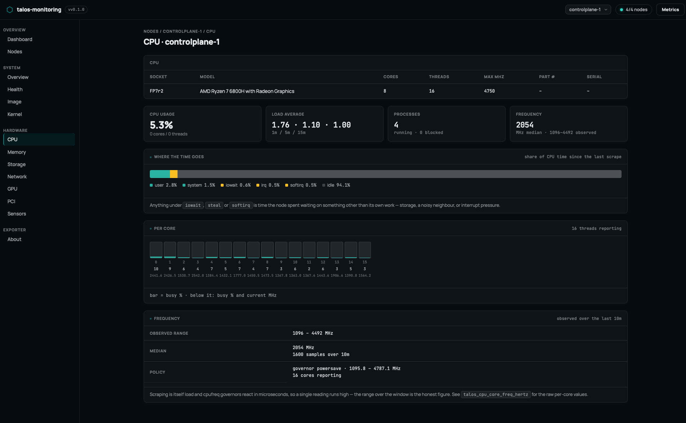

## Memory

Usage, cache and buffers, swap, and per-DIMM inventory.

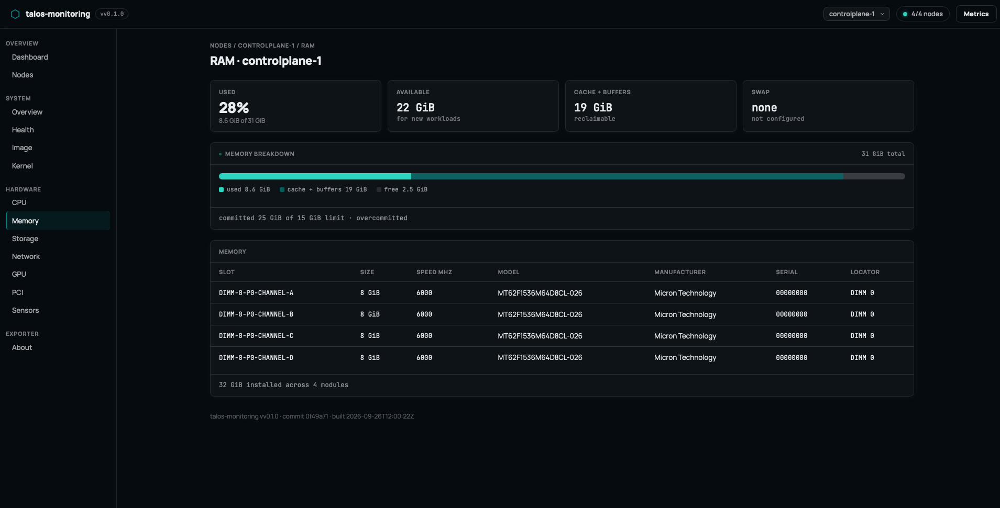

## Storage

Local capacity, physical block devices, Talos volumes, and
PersistentVolumes.

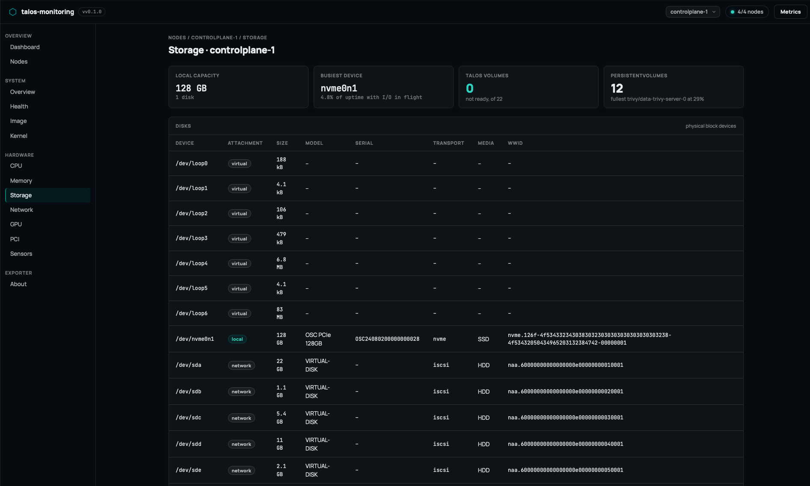

## Network

Interfaces, throughput, and cumulative counters (errors/drops) since boot.

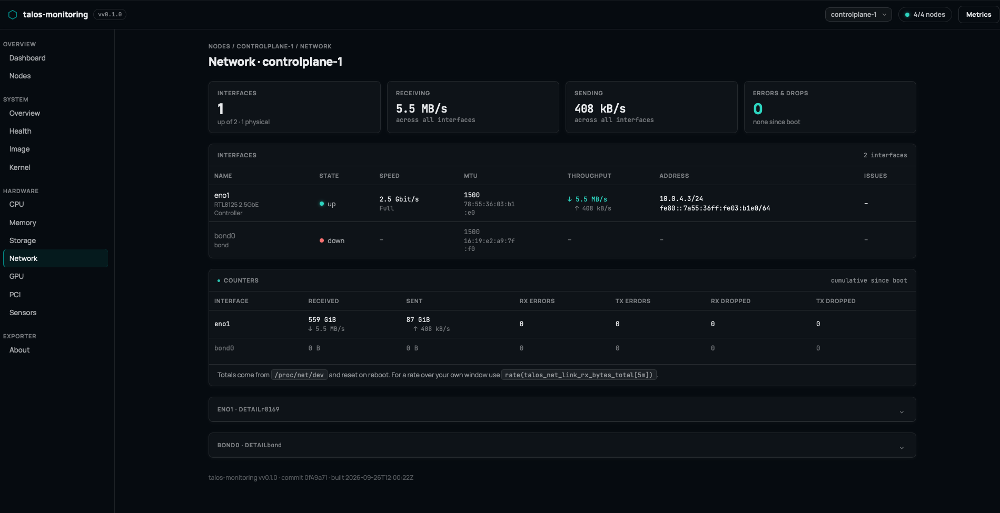

## GPU

Per-card utilisation, video memory, and thermals/power from GPU hwmon
chips.

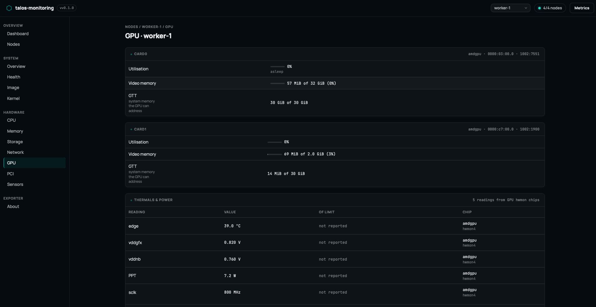

## PCI

Discovered PCI devices grouped by class.

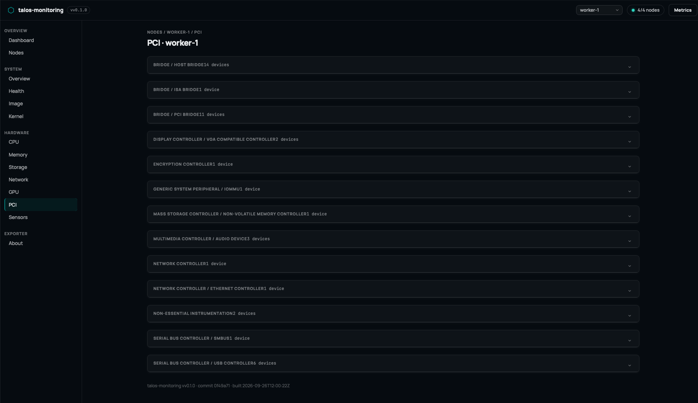

## Sensors

Temperature, voltage, power, and frequency readings across all hwmon
chips, with limits where reported.

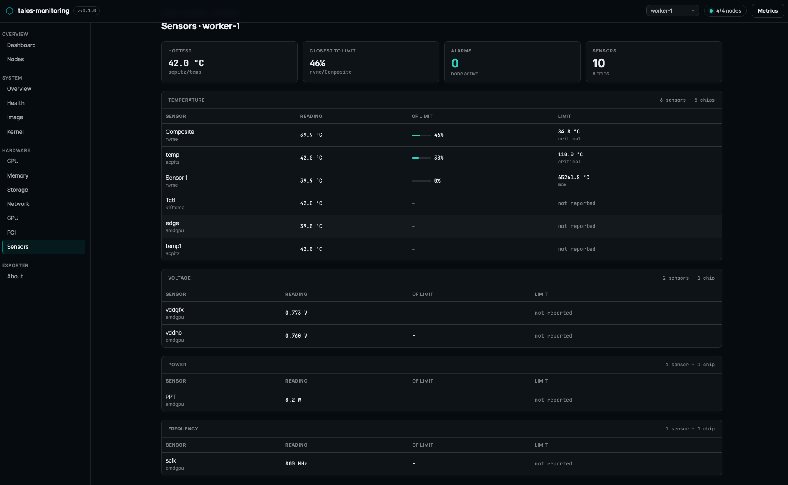
