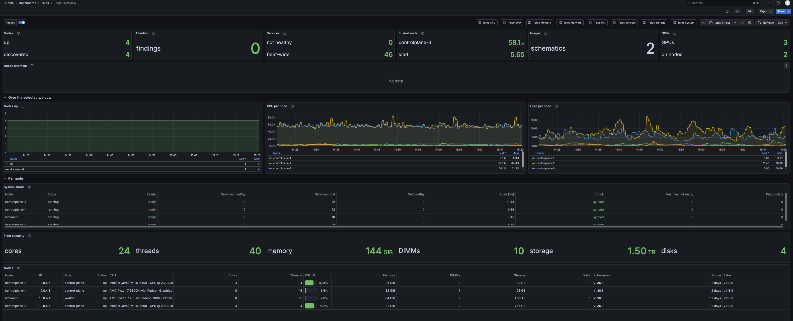
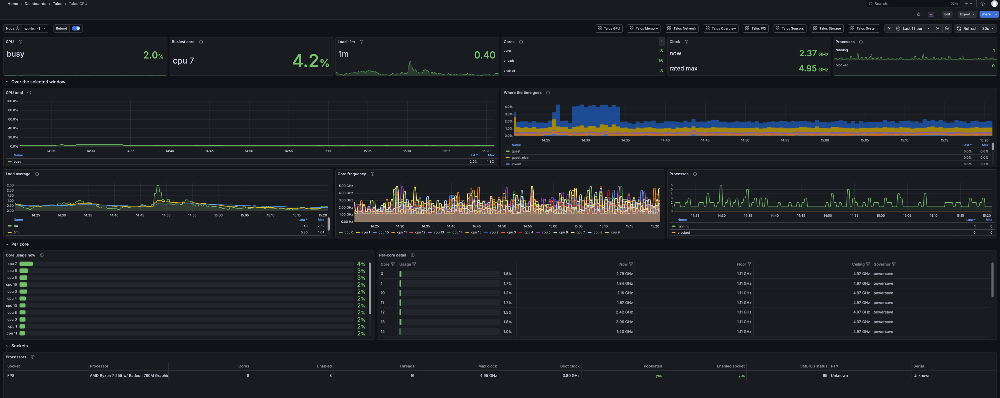
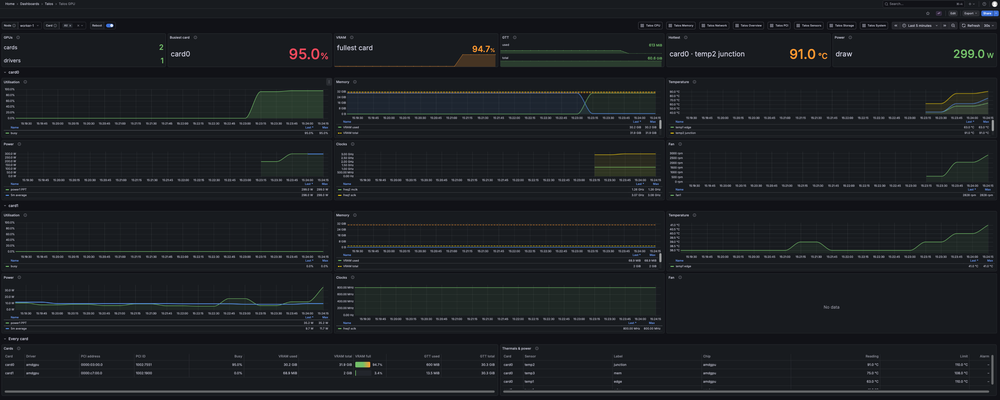
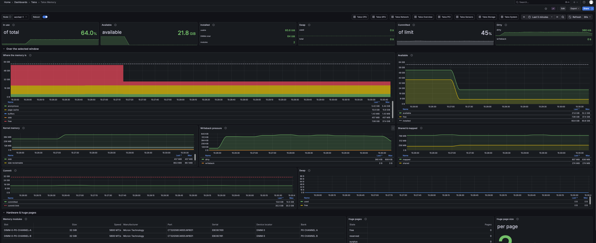
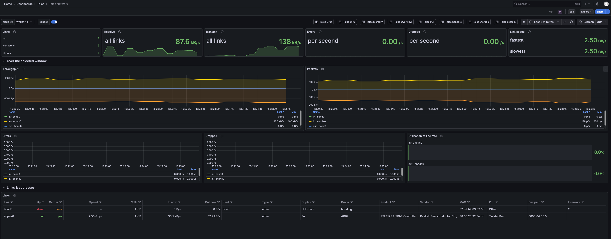
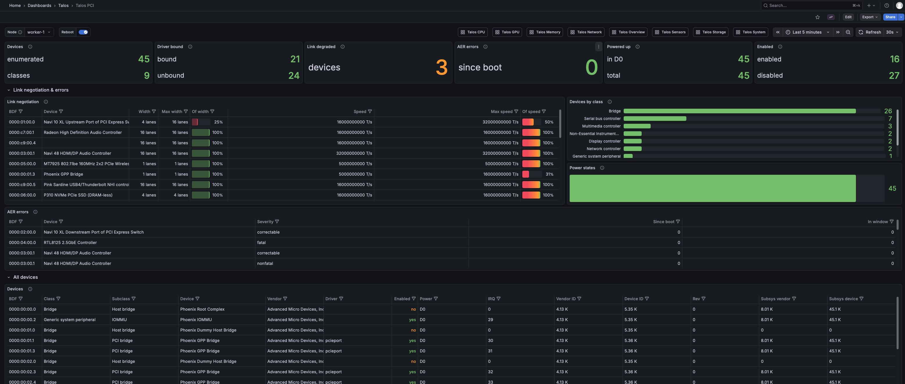
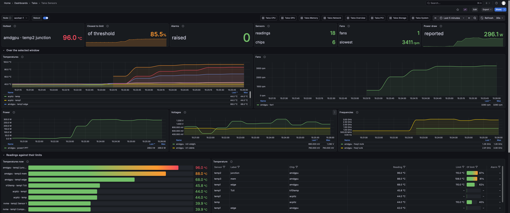
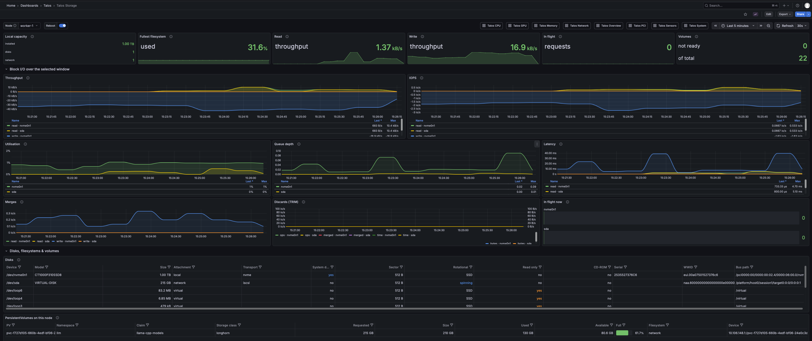
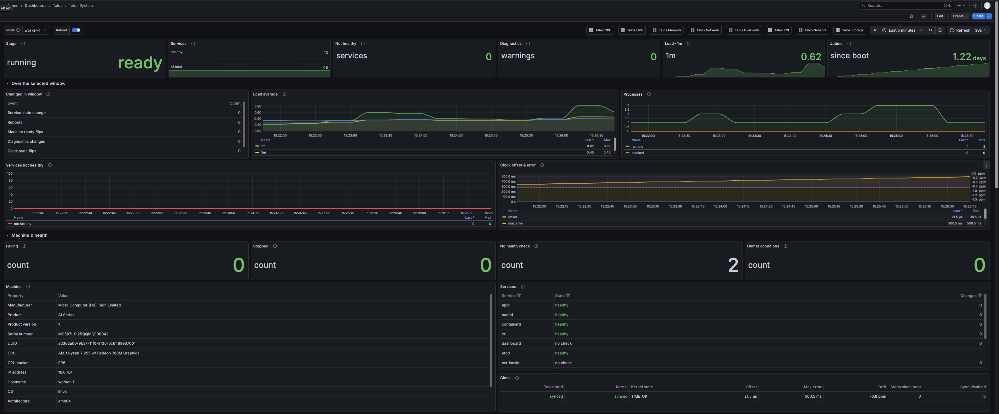
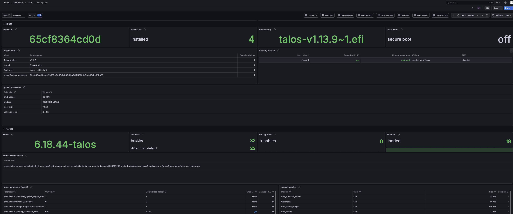

# Grafana dashboards

A look at the Grafana dashboards that ship with the Helm chart
(`charts/talos-monitoring/grafana/*.json`), scraping `/metrics`. Unlike the
built-in dashboard, these keep whatever history your Prometheus retention
allows, so they are the place for trends, comparisons across nodes, and
alerting.

See [`built-in-dashboard.md`](built-in-dashboard.md) for the live, no
setup dashboard the app serves itself, and [`METRICS.md`](METRICS.md) for
the metric reference.

## Overview

Fleet-wide summary and per-node history: nodes up, attention findings,
busiest node, fleet capacity, and CPU/load per node over the selected
window.

## CPU

Per-node CPU usage, load, where the time goes, core frequency over time,
and per-core detail with governor and floor/ceiling clocks.

## GPU

Per-card utilisation, memory, clocks, power, and temperature over time,
plus a table of every card and its thermals.

## Memory

Usage and availability history, where the memory is spent (anonymous, page
cache, buffers, slab), kernel memory, writeback pressure, commit, swap,
and per-DIMM inventory with huge pages.

## Network

Throughput and packet rate history, errors and drops over time, link
utilisation, and a table of links with speed, duplex, and driver.

## PCI

Link negotiation and AER errors, devices by class, power states, and the
full device table.

## Sensors

Temperature, fan, power, voltage, and frequency history, plus readings
against their configured limits.

## Storage

Block I/O throughput, IOPS, utilisation, queue depth, and latency history,
plus disks, filesystems, and PersistentVolumes.

## System

Machine stage, service health, load and clock offset history, plus
machine identity and per-service state.

The same dashboard also covers image and kernel state: schematic, boot
entry, security posture, installed extensions, and kernel tunables
compared against their defaults.

